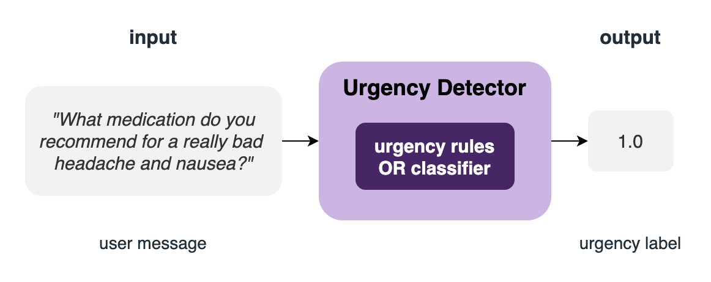

# FAQT

FAQT gives you a suite of approaches for matching text to existing content (like FAQs) or detecting urgency in a text in low and high resource settings.

[](https://coveralls.io/github/IDinsight/faqt?branch=main)


## How it works
### FAQ matching
FAQT's FAQ Scorers score text (e.g. user message) against a list of predetermined
contents (e.g. FAQs) based on their relevance to the text.

The Scorer class needs the contents and some pre-trained NLP model to do the match
scoring. It outputs the match score for each of the content.


* For Scorers that use word embeddings, scoring is based on the distances between
  words or sets of words from the message and the contents.
* For the BERT-based Scorer, it accepts a BERT model with a final binary classification
  layer, which classifies (scores) the pair, e.g. user message and each of the FAQs, as
  relevant (1.0) or not (0.0).
### Urgency detection

Currently, FAQT provides two models for urgency detection: rule-based and
machine-learning-based (ML-based). The Urgency Detector accepts a raw text as input and
outputs the urgency score (between 0.0 and 1.0) or an urgency label (0.0 for not urgent,
1.0 for urgent.)



* The rule-based Urgency Detector expects a list of keyword rules, and evaluates urgency
  based on the presence or absence of the keywords.
* The ML-based Urgency Detector expects a scikit-learn-like pipeline that accepts raw text
and outputs an urgency score between 0.0 and 1.0. Hence, this pipeline should include
all necessary steps like tokenization and vectorization.
# Installation

Eventually FAQT will be open-source and available from PyPI. In the meantime, you can use `pip` to install it from github:
```bash
pip install git+https://@github.com/IDinsight/faqt.git@main
```
It will prompt you for your username and password since the repository is private.

## Extended installation
To use a BERT-based model such as `faqt.model.faq_matching.bert.QuestionAnswerBERTScorer` or  the `faqt.preprocessing.tokens.CustomHunspell` class, install faqt with its `extended` optional dependencies:
```bash
pip install git+https://@github.com/IDinsight/faqt.git@main[extended]
```

# Basic Usage

## FAQ matching 
We show an example that uses the `WMDScorer` class, which requires a word embedding and
computes scores based on word mover's distance between the word vectors of the input and
word vectors of the content.

1. Load a word embedding in a `gensim.models.KeyedVectors` class.
    ```python
    from gensim.models import Word2Vec

    word_embedding = Word2Vec.load_word2vec_format(
        "GoogleNews-vectors-negative300.bin", # some pre-trained embedding
        binary=True, 
        norm_only=True
    )
    ```
2. Load FAQ contents.
    ```python
    faqs = [
        "**How do I edit a page?** Editing most Wikipedia pages is easy, just click the \"Edit\" tab at the top of a Wikipedia page.",
        "**How do I create a new page?** You are required to have a Wikipedia account to create a new article.",
        "**How do I change the name of an article?** You can move the article using the \"move\" button."
    ]
    ```
3. Create a FAQ-matching model.
    ```python
    from faqt.models import WMDScorer

    faq_scorer = WMDScorer(word_embedding)
    faq_scorer.set_contents(faqs)
    ```
4. Score FAQs against a message.
    ```python
    scores = faq_scorer.score_contents(
        "I want to edit a page on Wikipedia"
    )
    ```

    `scores` contains a list of scores for each FAQ content:
    ```python
    [0.924, 0.345, 0.456]
    ```

## Urgency Detection
We show an example that uses the `RuleBasedUD`.

1. Define a preprocessor. Since the rule-based model simply looks for the presence and
   absence of the tokens, you should apply the same preprocessing to the keywords as you
   would to the messages. In this example, we will use `nltk`'s tokenizer and stemmer.
    ```python
    from nltk.tokenize import word_tokenize
    from nltk.stem.porter import PorterStemmer

    def preprocess(text):
        stemmer = PorterStemmer()

        tokens = word_tokenize(text)
        stemmed_tokens = [stemmer.stem(token) for token in tokens]

        return stemmed_tokens
    ```

2. Define `KeywordRule`'s, each describing an urgent case.
    ```python
    from faqt.models import KeywordRule

    rules = [
        KeywordRule(
            include=[preprocess(word) for word in ["blurry", "vision", "headache"]]
        ),
        KeywordRule(
            include=[preprocess(word) for word in ["vomit", "headache"]]
        )
    ]
    ```

2. Create a rule-based urgency detector
    ```python
    from faqt.model import RuleBasedUD

    ud_model = RuleBasedUD(model=rules, preprocessor=preprocess)
    ```

3. "Predict" or evaluate!
    ```python
    ud_model.predict(
        "I keep getting headaches and my vision is blurry. Is this normal?"
    )
    ```
    This should return the value 1.0.

# Development

To develop FAQT, clone this repository and run the following at the repository root:
```bash
pip install -e '.[dev]'
```
This installs all the additional dependencies required for development.
