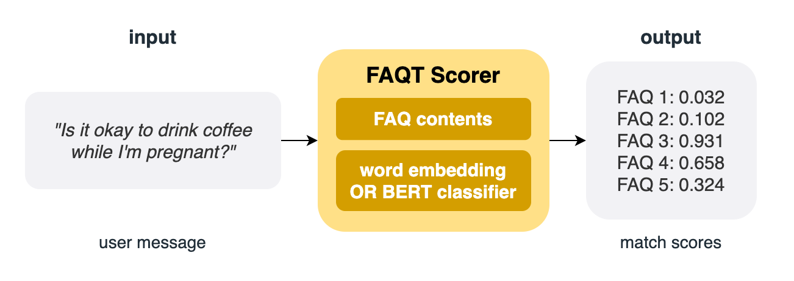
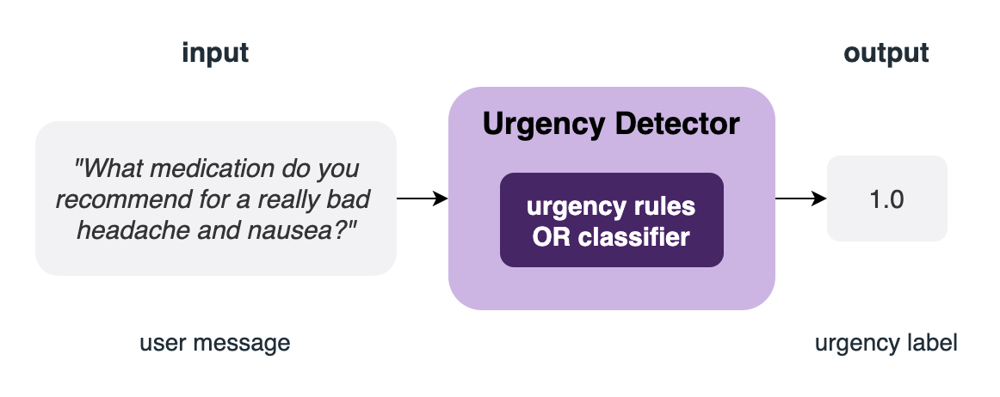

.. FAQT documentation master file, created by
   sphinx-quickstart on Mon Mar 28 11:37:23 2022.
   You can adapt this file completely to your liking, but it should at least
   contain the root `toctree` directive.

.. module:: faqt
Welcome to FAQT's documentation!
================================
**FAQT** gives you a suite of approaches for matching text to existing content (like FAQs) or detecting urgency in a text in low and high resource settings.

FAQT's FAQ Scorers score text (e.g. user message) against a list of predetermined
contents (e.g. FAQs) based on their relevance to the text.

The Scorer class needs the contents and some pre-trained NLP model to do the match
scoring. It outputs the match score for each of the content.

The Urgency Detector accepts a raw text as input and
outputs the urgency score (between 0.0 and 1.0) or an urgency label (0.0 for not urgent,
1.0 for urgent.)

Check out the :doc:`usage` section for further information.

.. note::
   This project is under active development and API may change substantially.

Usage
--------
.. toctree::
   :maxdepth: 4

   usage

Contents
--------
.. toctree::
   :maxdepth: 3

   faqt

Indices and tables
==================

* :ref:`genindex`
* :ref:`modindex`

